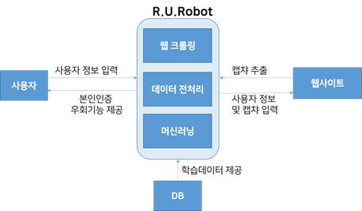
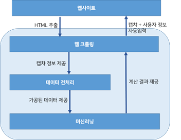
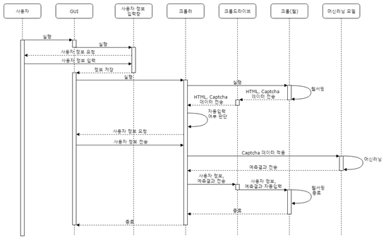
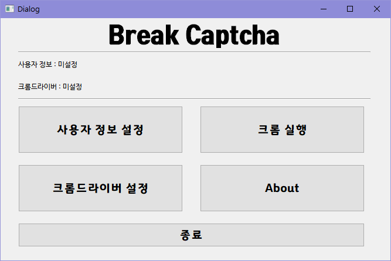
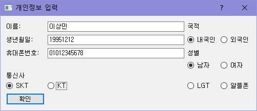
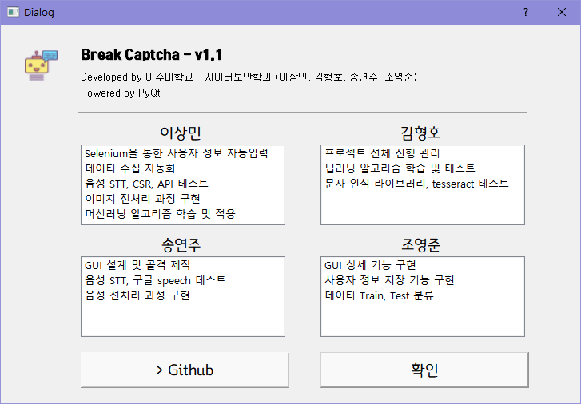

# Break Captcha

- **Break Captcha** v1.1 [다운로드](https://github.com/sm0514sm/BreakCaptcha/raw/master/Captcha%20Breaker.exe)
- **Sound Model** [다운로드](https://github.com/sm0514sm/BreakCaptcha/raw/master/SoundModel.pkl) (BreakCaptcha.exe와 같은 폴더에 존재해야 함)
- **Chrome Driver** [다운로드](https://chromedriver.chromium.org/downloads) (현재 크롬과 동일한 버전 설치 후 지정)

## 개요

 Captcha (Completely Automated Public Turing test to tell Computers and Humans Apart, 이하 캡챠)는 HIP기술의 일종으로, 어떠한 사용자가 실제 사람인지 컴퓨터 프로그램인지를 구별하기 위해 사용되는 방법이다. 사람은 구별할 수 있지만 컴퓨터는 구별하기 힘들게 의도적으로 비틀거나 덧칠한 그림이나 숫자나 텍스트를 읽어주는 오디오를 주고 그 내용을 물어보는 방법이 사용된다. 현재 로그인시나 본인인증시에 널리 사용되고있다. 

 하지만 이러한 사용자인증방식은 인공지능의 발전이 대두됨에 따라 신뢰성을 위협받고 있다. 2018년 8월 한국정보화진흥원에서 발표한 인공지능 악용에 따른 위협과 대응 방안 리포트에 의하면, 인공지능은 범죄 목적으로 개발, 악용되는 사례가 늘어나고 있다. 특히 인공지능은 범죄성 사이버 공격 프로세스 작업 자동화가 가능하고, 인간행위와 인간인지능력을 모방할 수 있다는 점에서 디지털보안 분야에서 높은 파괴력을 보일 수 있다. 

 본 프로젝트는 위와 같은 문제점을 인식하고 국내의 본인인증 서비스의 신뢰성을 조사하여 사용자로부터 보다 안전한 본인인증 서비스를 제공하고자 시작하게 되었다. 본 프로젝트에서는 **인공지능을 활용한 안티캡챠(Anti-captcha) 프로그램을 개발하여 국내 사이트의 캡챠 기능을 활용하는 휴대폰 본인인증 서비스의 신뢰성을 검증**한다. 

## 시스템 구조 (Context Diagram)

 본 프로그램의 전체 구조는 위 그림과 같다. 본 프로그램의 기능은 크게 **웹 크롤링, 데이터 전처리, 머신러닝**으로 나뉘어져 있으며, 사용자와 웹사이트 사이에서 인터렉션한다. 사용자가 프로그램을 사용할 때에는 먼저 사용자는 본 프로젝트의 실행 프로그램을 실행 시킨 후 사용자의 정보를 입력시킨다. 이후 프로그램을 통해 크롬을 실행하면 프로그램은 크롬 드라이버를 통해 HTML elements를 수집하고 수집된 정보를 통해 사용자가 본인인증 서비스에 접근했는지를 판단한다. 만약 사용자가 본인인증 서비스에 접근했다면 웹사이트로부터 캡챠 이미지, 오디오
데이터를 추출하고 데이터 전처리 과정을 거친 데이터와 기존에 저장되어있던 학습 데이터와의 비교를 통해 예측 값을 도출한다. 도출해낸 값과 사용자정보를 웹사이트에 자동으로 입력한다. 이 과정은 사용자가 크롬을 종료할 때까지 반복된다.

 프로그램의 내부 구조에 대해 더 자세하게 살펴보자면, 프로젝트는 크게 웹 크롤링, 데이터 전처리, 머신러닝 세가지 주요 기능을 가지고 있으며, 사용자가 본인인증 사이트에 접근하였을 때 웹 크롤링, 데이터 전처리, 머신러닝, 그리고 다시 웹 크롤링의 순서로 동작한다. 먼저, 사용자가 본인인증 사이트에 접근하였을 때 HTML elements를 탐색하여 캡챠 이미지 데이터와 오디오 데이터를 추출한다. 추출한 데이터는 데이터 전처리로 넘겨지게 되는데 데이터 전처리 단계에서는 제공받은 데이터들의 노이즈를 제거하고 머신러닝이 접근할 수 있는 객체 형태로 가공한다. 이후 전처리된 데이터들은 머신러닝으로 넘겨지게 되고 머신러닝은 기존에 가지고 있던 학습된 데이터와 넘겨받은 데이터들의 비교를 통해 값을 예측한다. 이렇게 계산된 결과들은 다시 웹 크롤러에게 넘겨지게 되고 웹 크롤러는 넘겨받은 캡챠 값과 프로그램 동작 전에 사용자로부터 입력받은 사용자 정보를 웹페이지 양식에 맞게 자동 입력한다. 

## 동작 과정

### 1. 메인 화면

사용자는 본 기능을 사용하기 위해 `사용자 정보 설정`버튼을 클릭해서 크롬 버전에 맞는 크롬 드라이버와 사용자 정보를 설정해야한다.

### 2. 사용자 정보 설정

자동입력될 사용자의 정보를 입력하고 확인을 클릭한다.

### 3. 크롬드라이버 위치 지정

`크롬드라이버 설정`버튼을 클릭해서 크롬 버전과 동일한 크롬드라이버를 설치하여 경로를 지정해둔다.

### 4. 크롬 실행

`크롬 실행` 버튼을 클릭해 인터넷 서핑을 한다.

### 5. Captcha 파훼

본 프로그램이 작동할 수 있는 사이트를 인식하면 다음과 같이 자동으로 Captcha문자와 사용자 정보가 입력된다.

---

> **Developed by** 아주대학교 - 사이버보안학과 (이상민, 김형호, 송연주, 조영준)
>
> 